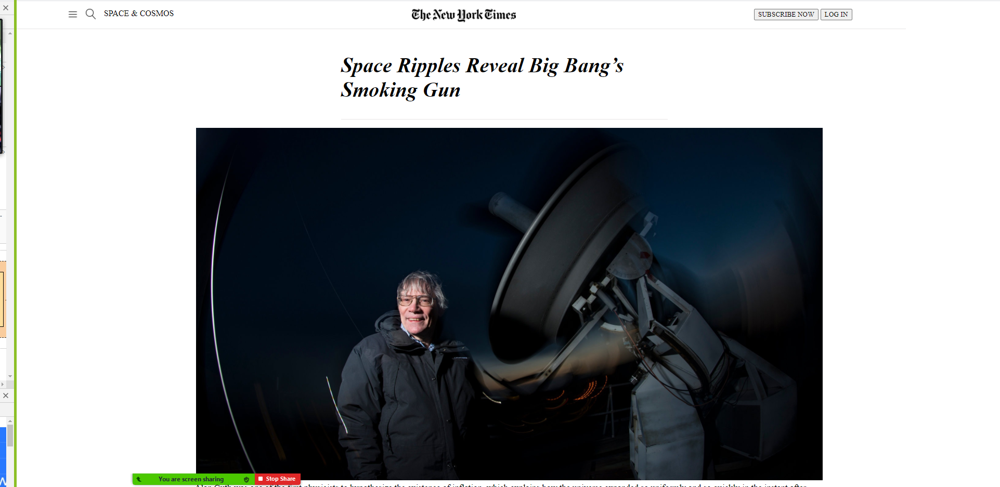

# Project Name

> Project 1: Positioning and floating elements
  This is a clone of the New York Times. In this project i used flexbox, float and grid for positioning elements.

## Built With

- Html
- CSS

## Live Demo

[Live Demo Link](https://pountzas.github.io/Project-1-Positioning-and-Floating-Elements/)

To get a local copy up and running follow these simple example steps.
### Setup
- open your Terminal, go to the desired folder and write the following commands

- git init
- git clone https://github.com/pountzas/Project-1-Positioning-and-Floating-Elements.git

👤 **Author**

- GitHub: [@pountzas](https://github.com/pountzas)
- Twitter: [@pountzas20](https://twitter.com/pountzas20)
- LinkedIn: [LinkedIn](https://www.linkedin.com/in/nikos-pountzas-173ba4a8/)

## 🤝 Contributing

Contributions, issues, and feature requests are welcome!

Feel free to check the [issues page](issues/).

## Show your support

Give a ⭐️ if you like this project!
## 📝 License

This project is [MIT](lic.url) licensed.
